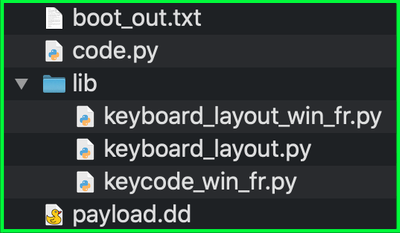

How to use one of these layouts with [the pico-ducky repository](https://github.com/dbisu/pico-ducky).

## First step

#### Go to the [latest release page](https://github.com/Neradoc/Circuitpython_Keyboard_Layouts/releases/latest), look if your language is in the list.

## If your language/layout is in the bundle

Download the `py` zip, named `circuitpython-keyboard-layouts-py-XXXXXXXX.zip`

**NOTE: You can use the mpy format targetting the version of Circuitpython that is on the device (6 or 7), but on Raspberry Pi Pico you don't need it - it only reduces file size and RAM used for loading the library, which the pico has plenty of.**

## If your language/layout is not in the bundle

Try the online generator, it should be able to generate a zip file with the modules for your language.

https://www.neradoc.me/layouts/

## Now you have a zip file

### Find your language/layout in the lib directory 

For a language `LANG`, copy the following files from the zip's `lib` folder to the `lib` directory of the board.  
**DO NOT** modify the adafruit_hid directory. Your files go directly in `lib`.  
**DO NOT** change the names or extensions. Just pick the files you need.  
Replace `LANG` with the letters for your language of choice.

- `keyboard_layout_win_LANG.py`
- `keycode_win_LANG.py`

This is what it should look like **if your language is French for example**.



Don't forget to also install [the adafruit_hid library](https://github.com/adafruit/Adafruit_CircuitPython_HID/releases/latest) in the lib directory.

### Modify the pico-ducky code to use your language file:

At the start of the file remove or comment out these lines (add `#` at the start of the line).

```py
from adafruit_hid.keyboard_layout_us import KeyboardLayoutUS as KeyboardLayout
from adafruit_hid.keycode import Keycode
```

And add or uncomment (remove the `#`) these lines.  
*Replace `LANG` with the letters for your language of choice. The name must match the file (without the py or mpy extension).*
```py
from keyboard_layout_win_LANG import KeyboardLayout
from keycode_win_LANG import Keycode
```
